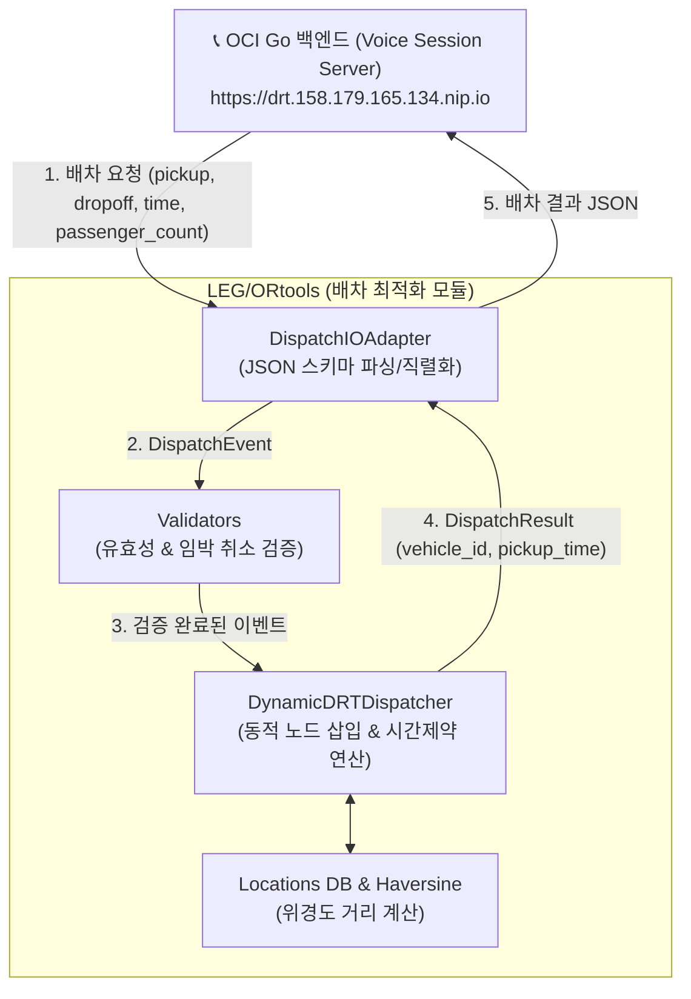

# 🚌 DRT AI 콜센터 — 동적 배차 최적화 엔진 (OR-tools)

수요응답형 교통(DRT, Demand Responsive Transport) AI 콜센터의 핵심인 **실시간 동적 배차 및 경로 최적화 엔진(Dynamic Dispatching Engine)** 모듈입니다.

사용자의 전화/음성 대화를 통해 전달된 승차·하차·시간·인원 요청을 파싱하여, 실시간으로 최적의 차량을 할당하고 동적 노드 삽입(Dynamic Insertion), 취소/변경 처리 및 시간 제약(Time Window) 검증을 수행합니다.

---

## 🌟 주요 기능

1. **동적 배차 알고리즘 (`dispatch.DynamicDRTDispatcher`)**
   - Haversine 공식을 이용한 정밀 위치 기반 거리 및 이동 시간 계산
   - 승객 신규 요청 시 기존 운행 중인 차량 경로에 대한 **동적 노드 삽입(Dynamic Insertion)** 연산
   - 차량 정원(Capacity), 승/하차 순서(Pickup before Dropoff), 과거 시간 요청 거절 및 기존 승객 지연 방지 제약조건 검증

2. **이벤트 처리 및 예외 관리 (`dispatch.validators`)**
   - 신규 예약(`new_reservation`), 취소(`cancellation`), 변경(`change`)의 3대 이벤트 수용
   - 임박 취소(Imminent Cancellation) 감지 및 에러 코드(`NO_VEHICLE_AVAILABLE`, `CAPACITY_EXCEEDED`, `PAST_TIME` 등) 명확화

3. **백엔드 통신 I/O 변환 계층 (`dispatch.DispatchIOAdapter`)**
   - 백엔드 서버(`LEG/BE`) 및 오케스트레이터의 JSON 스키마 규격과 100% 호환되는 파싱 및 직렬화 계층 제공

---

## 🗂️ 프로젝트 구조

```text
LEG/ORtools/
├── dispatch/                         # 🧠 배차 시스템 핵심 엔진 (Core Package)
│   ├── __init__.py                   # Public API export (DynamicDRTDispatcher, DispatchIOAdapter 등)
│   ├── config.py                     # 배차 엔진 하이퍼파라미터 및 기본 설정
│   ├── engine.py                     # 배차 최적화 및 동적 삽입 알고리즘 (Core Engine)
│   ├── io_adapter.py                 # 팀 표준 JSON <-> 내부 객체 변환 데이터 어댑터
│   ├── locations.py                  # Haversine 거리 계산 및 장소(Latitude/Longitude) DB
│   ├── models.py                     # dataclass 기반 데이터 모델 (Vehicle, PassengerRequest 등)
│   └── validators.py                 # 이벤트 유효성 검증 및 임박 취소 판단
│
├── tests/                            # 🧪 엔진 기능 및 시나리오 검증 테스트
│   ├── check_tts_labels.py           # 음성 라벨 유틸리티
│   └── test_scenarios.py             # 다양한 승/하차 및 취소/변경 시나리오 테스트
│
└── README.md                         # 본 문서
```

---

## 🔄 시스템 아키텍처 및 데이터 흐름



---

## 🤝 백엔드(`LEG/BE`) 연동 명세 (Contract)

본 배차 엔진은 Go 기반 백엔드 서버(`drt-call-backend`)의 연동 규격과 **100% 호환**되도록 설계되었습니다.

### 1. 필드 매핑 명세

| 구분 | 백엔드 API 요청 (`/drt/reservations`) | OR-tools 입력 (`DispatchEvent`) | 설명 |
|---|---|---|---|
| **출발지** | `pickup` / `origin` | `payload.pickup` | 한글 장소명 또는 위치 키 |
| **목적지** | `dropoff` / `destination` | `payload.dropoff` | 한글 장소명 또는 위치 키 |
| **희망 시간** | `time` / `requested_pickup_at` | `payload.requested_pickup_time` | `"HH:MM"` 또는 ISO 8601 |
| **탑승 인원** | `passenger_count` | `payload.passenger_count` | 정수 (명) |

### 2. 처리 결과 리턴 (`DispatchResult`)

배차 성공 시 아래 포맷으로 직렬화되어 백엔드로 전달됩니다:
```json
{
  "seq": 1,
  "session_id": "sess_001",
  "status": "success",
  "action": "new_reservation",
  "vehicle_id": "DRT-1004",
  "pickup_time": "15:00",
  "pickup_location": "수원역",
  "dropoff_location": "판교역"
}
```

---

## 💻 파이썬 코드 사용 예시

```python
from dispatch import DynamicDRTDispatcher, DispatchIOAdapter
from dispatch.models import Vehicle, Location

# 1. 어댑터 및 배차 엔진 초기화
adapter = DispatchIOAdapter()
dispatcher = DynamicDRTDispatcher()

# 2. 초기 차량 등록
dispatcher.register_vehicle(
    Vehicle(vehicle_id="DRT-1004", capacity=4, current_location=Location(37.2636, 127.0001, "depot"), is_active=True)
)

# 3. 요청 이벤트 파싱 및 처리
raw_event = {
    "seq": 1,
    "event_type": "new_request",
    "event_time": "14:30",
    "payload": {
        "pickup": "수원역",
        "dropoff": "판교역",
        "requested_pickup_time": "15:00",
        "passenger_count": 2
    }
}

event = adapter.parse_event(raw_event)
result = dispatcher.process_event(event)

# 4. 결과 출력
print(adapter.build_output(result))
```

---

## 🧪 테스트 실행

엔진 시나리오 검증 테스트는 아래 명령어로 수행할 수 있습니다.

```bash
# 시나리오 테스트 실행
python tests/test_scenarios.py
```
